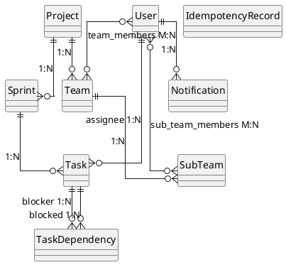

# TeamCoord Backend

Spring Boot backend для платформы координации коротких командных проектов
(хакатоны, учебные проекты, game jam'ы; длительность проекта ≤ 14 дней,
длительность спринта 1–3 дня).

## Бизнес-сценарии (не CRUD)
1. Назначение участников в sub-team с проверкой наличия lead (warning через Notification).
2. Анализ состава команды — выявление дисбаланса ролей (нет lead, перекос джунов, пустая команда и т.п.).
3. Перевод задачи в `IN_PROGRESS` с проверкой:
   - все зависимости (`TaskDependency`) выполнены;
   - исполнитель не перегружен (`max-active-tasks-per-user`).
4. `findCriticalTasks` — поиск критических задач (приоритет CRITICAL или блокирует ≥ N других).
5. `escalate-critical` — авто-повышение приоритета задач, блокирующих ≥ N других, до `CRITICAL`.
6. `complete-sprint` — закрытие спринта, создаёт Notification для исполнителей незавершённых задач.
7. `bulk-rebalance` — перераспределение задач спринта между участниками команд проекта (идемпотентно по `Idempotency-Key`).
8. Плановые уведомления (`@Scheduled`) о просроченных задачах — без дублей.

## Сущности и связи
- `User (1) ─< Team.members` (M:N через `team_members`)
- `User (1) ─< SubTeam.members` (M:N через `sub_team_members`)
- `Project (1) ─< Team (N)` (UNIQUE `project_id, name`)
- `Project (1) ─< Sprint (N)`
- `Team (1) ─< SubTeam (N)` (UNIQUE `team_id, name`)
- `Sprint (1) ─< Task (N)`
- `User (1) ─< Task.assignee (N)`
- `Task ─< TaskDependency (blockerTask, blockedTask)` (UNIQUE `blocker_task_id, blocked_task_id`)
- `User (1) ─< Notification (N)`
- `IdempotencyRecord` — уникальный `idempotency_key`.

Все entity снабжены `@Version` (Optimistic locking) → 409 Conflict при конкурентной записи.

### ER-диаграмма (PlantUML)

> Отрендерить можно на <https://www.plantuml.com/plantuml> (вставить блок выше) или плагином PlantUML в IDE.

### Индексы и обоснование
Индексы заведены под поля, по которым идёт фильтрация/сортировка (см. комментарии в миграциях):
- `idx_tasks_status`, `idx_tasks_assignee` — фильтры `status` / `assigneeId` в `GET /api/v1/tasks`.
- `idx_projects_status`, `idx_projects_start_date` — фильтры `status` и `startDateFrom/To` + `sort=startDate` в `GET /api/v1/projects`.
- `idx_tasks_sprint_status` (composite) — sprint-scoped операции (`complete-sprint`, `bulk-rebalance`, `escalate-critical`): всегда фильтр по `sprint_id`, часто + `status`.
- `idx_tasks_deadline_status` — плановый (`@Scheduled`) скан просроченных задач по `deadline` + `status`.
- UNIQUE-индексы (`project_id,name`; `team_id,name`; `blocker_task_id,blocked_task_id`; `idempotency_key`) — доменные инварианты, нарушение → 409.

## Архитектура
- REST API: `/api/v1/...`
- JPA + PostgreSQL + Flyway миграции (`db/migration/V1__…`, `V2__…`).
- Security: JWT (HS256, secret ≥ 32 байт), роли `USER` / `ADMIN`.
- Инфраструктура: events (`ApplicationEventPublisher`), `@Async` для рассылки, `@Scheduled` для напоминаний, кэш на `getProject`, MapStruct, idempotency, Actuator + кастомный health.
- Полноценный CRUD для: User, Project, Task, Team, SubTeam, Sprint, TaskDependency.
- Списочные endpoint'ы (page+size+sort+ ≥3 фильтра):
  - `GET /api/v1/users`        — `role`, `level`, `enabled`
  - `GET /api/v1/projects`     — `status`, `startDateFrom`, `startDateTo`, `nameContains`
  - `GET /api/v1/tasks`        — `status`, `assigneeId`, `priority`

## Запуск

### Через Docker (рекомендуется)
```bash
JWT_SECRET="please-change-this-jwt-secret-32-bytes-min" docker compose up --build
```
Postgres стартует с healthcheck, app поднимается только после готовности БД.
Данные сохраняются в named volume `pgdata`.

### Локально
1. Поднять PostgreSQL (`docker run -p 5432:5432 -e POSTGRES_DB=teamcoord -e POSTGRES_USER=teamcoord -e POSTGRES_PASSWORD=teamcoord postgres:16`).
2. Задать переменные окружения:
   - `DB_URL`, `DB_USER`, `DB_PASSWORD` (есть значения по умолчанию для локального запуска)
   - `JWT_SECRET` — **обязательно**, минимум 32 байта
   - `MAIL_HOST`, `MAIL_PORT`, `MAIL_USERNAME`, `MAIL_PASSWORD` — опционально, для рассылки
   - `BOOTSTRAP_ADMIN_EMAIL`, `BOOTSTRAP_ADMIN_PASSWORD` — переопределить дефолтного admin'а
3. Сборка и запуск:
   ```bash
   ./gradlew clean bootJar
   JWT_SECRET="please-change-this-jwt-secret-32-bytes-min" java -jar build/libs/vk-0.0.1-SNAPSHOT.jar
   ```

## Bootstrap admin
При первом старте автоматически создаётся пользователь:
- email: `admin@local` (`BOOTSTRAP_ADMIN_EMAIL`)
- password: `admin12345` (`BOOTSTRAP_ADMIN_PASSWORD`)
- role: `ADMIN`, level: `LEAD`

**После первого логина обязательно смените пароль** (`PUT /api/v1/users/{id}`).

## Тесты
- Unit и контрактные (без Docker): `./gradlew test`
- Интеграционные с Testcontainers (нужен Docker): `./gradlew integrationTest`
- Полный прогон: `./gradlew test integrationTest`

> **Note.** Testcontainers `1.21.x` (через transitive `docker-java 3.x`) и Docker Engine 29.x несовместимы — Engine 29 возвращает HTTP 400 на `/info`, который docker-java использует для valid-environment check. Если на твоей машине Docker Desktop 4.60+, для прогона `integrationTest` используй Docker Desktop ≤ 4.55 либо `colima` / Podman, либо запускай только unit-тесты — `./gradlew test`. End-to-end проверка через `docker compose up` работает в любом случае, потому что Spring Boot обращается к Postgres напрямую, без docker-java.

## Коды ошибок
Все ошибки — единый JSON: `{timestamp, status, error, message, path, fieldErrors?}`.
- `400 Bad Request` — Bean Validation, malformed JSON, неподходящий тип параметра запроса.
- `401 Unauthorized` — нет токена / битый / просроченный JWT.
- `403 Forbidden` — аутентифицирован, но нет роли (например `USER` → ADMIN endpoint).
- `404 Not Found` — ресурс не найден или маршрут отсутствует.
- `409 Conflict` — business rule, доменное правило, optimistic-lock конфликт, нарушение DB-инварианта.
- `500 Internal Server Error` — неожиданная ошибка без утечки стека.

## Корреляция логов
Каждый HTTP-запрос получает `traceId` (UUID или входной `X-Request-Id`) и пишется в каждый лог:
```
INFO [app] [d25b3686-3b90-48c6-916a-2e2799045c3a] --- CoreService : escalateCriticalTasks ...
```
`X-Request-Id` возвращается в response-header для клиентской корреляции.

## Swagger
- `http://localhost:8080/swagger-ui.html`

## Примеры curl

### 1. Логин admin'ом
```bash
curl -s -X POST http://localhost:8080/api/v1/auth/login \
  -H "Content-Type: application/json" \
  -d '{"email":"admin@local","password":"admin12345"}'
# -> {"token":"<JWT>"}
TOKEN=...   # вставить значение из ответа
```

### 2. CRUD: создать проект
```bash
curl -X POST http://localhost:8080/api/v1/projects \
  -H "Authorization: Bearer $TOKEN" -H "Content-Type: application/json" \
  -d '{"name":"Jam-A","startDate":"2026-05-12","endDate":"2026-05-24","status":"ACTIVE"}'
```

### 3. CRUD: создать спринт (длительность 1–3 дня)
```bash
curl -X POST http://localhost:8080/api/v1/sprints \
  -H "Authorization: Bearer $TOKEN" -H "Content-Type: application/json" \
  -d '{"projectId":1,"name":"Sprint-1","startDate":"2026-05-12","endDate":"2026-05-14","status":"ACTIVE"}'
```

### 4. CRUD: создать задачу
```bash
curl -X POST http://localhost:8080/api/v1/tasks \
  -H "Authorization: Bearer $TOKEN" -H "Content-Type: application/json" \
  -d '{"sprintId":1,"title":"design schema","status":"TODO","priority":"HIGH","assigneeId":1,"estimatedHours":4}'
```

### 5. Список проектов с фильтрами + пагинацией
```bash
curl -G "http://localhost:8080/api/v1/projects" \
  -H "Authorization: Bearer $TOKEN" \
  --data-urlencode "page=0" \
  --data-urlencode "size=10" \
  --data-urlencode "sort=name,asc" \
  --data-urlencode "status=ACTIVE" \
  --data-urlencode "startDateFrom=2026-01-01" \
  --data-urlencode "startDateTo=2026-12-31" \
  --data-urlencode "nameContains=jam"
```

### 6. Business: анализ команды
```bash
curl -X GET http://localhost:8080/api/v1/business/team/1/analysis \
  -H "Authorization: Bearer $TOKEN"
```

### 7. Business: старт задачи (бизнес-проверки)
```bash
curl -X POST http://localhost:8080/api/v1/business/task/start \
  -H "Authorization: Bearer $TOKEN" -H "Content-Type: application/json" \
  -d '{"taskId":1}'
```

### 8. Business: автоэскалация критических задач
```bash
curl -X POST http://localhost:8080/api/v1/business/sprint/escalate-critical \
  -H "Authorization: Bearer $TOKEN" -H "Content-Type: application/json" \
  -d '{"sprintId":1}'
```

### 9. Business: завершить спринт
```bash
curl -X POST http://localhost:8080/api/v1/business/sprint/complete \
  -H "Authorization: Bearer $TOKEN" -H "Content-Type: application/json" \
  -d '{"sprintId":1}'
```

### 10. Business: bulk rebalance с idempotency
```bash
curl -X POST http://localhost:8080/api/v1/business/sprint/bulk-rebalance \
  -H "Authorization: Bearer $TOKEN" \
  -H "Idempotency-Key: rebalance-001" \
  -H "Content-Type: application/json" \
  -d '{"sprintId":1}'

# Повтор с тем же ключом вернёт replayed=true без повторного выполнения
curl -X POST http://localhost:8080/api/v1/business/sprint/bulk-rebalance \
  -H "Authorization: Bearer $TOKEN" \
  -H "Idempotency-Key: rebalance-001" \
  -H "Content-Type: application/json" \
  -d '{"sprintId":1}'
```

## Формат ошибки
```json
{
  "timestamp": "2026-05-11T12:00:00Z",
  "status": 400,
  "error": "Bad Request",
  "message": "Validation failed",
  "path": "/api/v1/projects",
  "fieldErrors": {"name": "must not be blank"}
}
```
